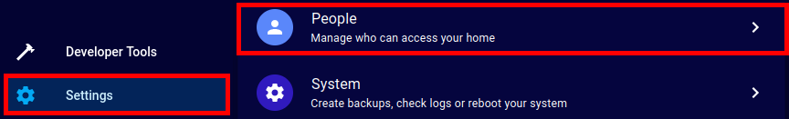

|  | Developers and tinkerers please check [CONTRIBUTING.md](./docs/CONTRIBUTING.md) for specific information about developing, building, translating and contributing. |
|------------------------------------------------------------|--------------------------------------------------------------------------------------------------------------------------------------------------------------------|
<h1 align="center">
  <br>
 
  <br>
Easy MQTT Handler
  <br>
</h1>
<h4 align="center">
Easy MQTT Handler is a MQTT Client implemented in Python3 that will connect to a MQTT Broker, <br/>
listening for freely configurable messages and reacting by executing arbitrary pre-defined commands. <br/>
It comes with a Qt5-based GUI (License: GPLv3+). 
</h4>

# Table of contents

- [Purpose of this tool](#purpose-of-this-tool)
- [Using this tool](#using-this-tool)
  - [Connection tab](#connection-tab)
  - [Payload Handlers tab](#payload-handlers-tab)
  - [Logs tab](#logs-tab)
  - [The Tooblar](#the-toolbar)
- [Configuration files](#configuration-files)
  - [Linux / MacOS](#linux--macos)
  - [Windows](#windows)
- [Command line arguments](#command-line-arguments)
- [Integrating with Home Assistant](#integrating-with-home-assistant)
  - [Creating your first automation wit Easy MQTT Handler](#creating-your-first-automation-wit-easy-mqtt-handler)
- [Roadmap](#roadmap)
- [Support](#support) 

# Purpose of this tool

Easy MQTT Handler was mainly developed to provide an easy way to integrate Personal Computers into Home Automation. The tool
offers a simple, but functional, GUI to connect to an MQTT Broker and listen to a topic. 

The user is able to define commands and parameters that should be part of the payload of the MQTT messages received from
the broker. For each command/parameter combination the user can then define an executable that should be launched 
once a certain command/parameter combination is received.

The tool is neatly integrating into the users' environment by sitting in the tray area as a tray icon. 

# Using this tool

The first time you start Easy MQTT Handler you will see the main application window. It's featuring a tabbed interface
with 3 tabs, a toolbar and a statusbar.

## Connection tab


In the Connection Tab the user can provide the Hostname, Port, Username, Password and Topic to connect to the MQTT Broker.
Furthermore, you can configure Easy MQTT Handler to make use of SSL/TLS, by ticking the checkbox **Use SSL/TLS**. Although,
SSL/TLS makes the setup a little bit more complicated it might still be worth it for you. You can configure the tool
just use SSL/TLS for encryption in transit, or even for client certificate authentication. If you want to set this up
please take a look at the [SSL/TLS Configuration](./docs/SSL.md) documentation. It will walk you through using
certificates provided by a Certificate Authority (CA) and self-signed certificates by using openSSL to create all the 
necessary certificates and your own CA.

## Payload Handlers tab


This tab is where the magic happens! To start click the **Add Payload** Button, which will create a new empty line in 
the table above the buttons. Now all you need to do is click on the cells of the tables to define the **Payload Command**
and **Payload Argument** to listen for. Next, set up whatever executable should be launched in the **Command to Run**
column. Should you need to add some command line parameters to the executable you can do so via the 
**Command line arguments** column. Look into the chapter [Integrating with Home Assistant](#integrating-with-home-assistant)
for some example.

Since **Version 0.1.2** there's a new feature for Power Users: It's parameters. With parameters, you can easily pass dynamic
command line arguments to the command you want to run. The process is quite straight-forward:

Set up the MQTT Payload like this: `{"command":"notify","args":"test", "param1":"test1", "param2":"test2"}`.

You can then use `$X` in the **Command line arguments** column. `$X` would be replaced by
the content of `paramX` within the payload. In our example if you put `$1 $2` into the **Command line arguments** column it
will be replaced with `test1 test2` once the above MQTT payload is received.

Should you have, e.g. `$3` defined in the **Command line arguments**, but the MQTT payload does not contain `param3`, `
$3` will be removed from the command line arguments automatically, in order to not be passed to the command you want to run.

## Logs tab


The last tab of the tool is the Logs tab: It should help the user to pinpoint any sort of potential problem that may 
arise with the connection to the broker and the tool's configuration.

## The Toolbar

These buttons are always visible:

|  | **Shows the licenses** |
|------------------------------------------------------------|------------------------|
|    | **Closes the tool**    |

These buttons are only visible if there's a connection established to a broker:

|  | **Disconnects from the broker** |
|----------------------------------------------------------------------|---------------------------------|
|    | **Reconnects to the broker**    |

This Button is only visible when there's no connection to a broker:

|  | **Connects to the broker** |
|----------------------------------------------------------------|----------------------------|

This button is only visible when the user did changes to the configuration:

|  | **Save the last changed settings** |
|---------------------------------------------------------------|------------------------------------|

Easy MQTT Handler will bug you automatically when you want to close the application without saving your changes. \
Just to make sure you never lose anything you've reconfigured.

# Configuration files

## Linux / MacOS

You should be able to locate the standard configuration files in your home directory. 
Here's the path you should be able to copy & paste: `~/.config/easy-mqtt-handler/` \
Inside you will find two files, usually: `default-settings.json` and `default-payloads.json`.

`default-settings.json` contains the connection configuration parameters. \
`default-payloads.json` contains all the payloads you defined.

It's possible to use other configuration files, in fact you can have as many as you want to. The trick is to
use [Command line arguments](#command-line-arguments) to launch Easy MQTT Handler.
You can also launch as many instances in parallel as you want, by starting them with different command line arguments.

## Windows

On Windows the configuration files are exactly the same. However, you will find them in `%appdata%\\easy-mqtt-handler\`. \
Press `[Win]`-key + `[R]` and type in `%appdata%\\easy-mqtt-handler\`, then click `[Ok]` and you should see the
configuration files.

# Command line arguments

```
usage: __main__.py [-h] [-mqtt-conf MQTT_CONFIGURATION_FILE]
                   [-payload-conf PAYLOAD_CONFIGURATION_FILE]

Easy MQTT Handler

options:
  -h, --help            show this help message and exit
  -mqtt-conf MQTT_CONFIGURATION_FILE, --mqtt-configuration-file MQTT_CONFIGURATION_FILE
  -payload-conf PAYLOAD_CONFIGURATION_FILE, --payload-configuration-file PAYLOAD_CONFIGURATION_FILE
```

# Integrating with Home Assistant

To integrate Easy MQTT Handler with Home Assistant first install the **mosquitto** addon. \
Login to your Home Assistant web interface, then click on **Settings** and select **Add-Ons**:


Afterwards, click the **Add-On Store** button:


In the Add-on Store click on the search box and type **mosquitto**. Then click the **Install** Button. Once installed
you can open the **Configuration** tab to configure mosquitto. \
You should then create a new user for Easy MQTT Handler to access mosquitto. To do so, click on **Settings** and next
select **People**:



Hit the **Add Person** button:


In the next dialog you only need to set **Display name**, **Username** and **Password**+**Confirm Password**. 
You will need the username and password for Easy MQTT Handler to connect to the mosquitto broker.


To use the Mosquitto as a broker in Home Assistant you need to go to the integration page and install the configuration 
with one click: Goto Settings -> Devices & Services -> Integrations. MQTT should now appear as a discovered integration 
at the top of the page. Select it and check the box to enable MQTT discovery if desired, then hit the submit button.

In theory this is all you need to connect Easy MQTT Handler with Home Assistant.

There's now two things you could do:

1. (optional) Enhance the security of your mosquitto broker by proceeding to [SSL/TLS Configuration](./docs/SSL.md)
2. Add an MQTT call to an automation to test the integration

### Creating your first automation wit Easy MQTT Handler

To create your first automation configure Easy MQTT Handler, first. As described in [Connection Tab](#connection-tab)
set up the connection to the mosquitto broker. Port **1883** should be used for MQTT, **8883** in case you've set up
SSL/TLS. There's no support for MQTT over Websocket at the moment. This example uses the topic **easy_mqtt_handler_pc1**.
As you can choose your topic freely, ymmv!

Next, move on to the [Payload Handlers Tab](#payload-handlers-tab). If you are on Linux here's a Payload Handler you 
could set up for testing (uses the tool notify-send, on Ubuntu it's inside the package `libnotify-bin`):


Now, head over to your Home Assistant's web interface and go to the **Settings** > **Automations & Scenes** page:


Here click the **Create Automation** button:


In the next dialog select **Create new automation**:


Finally, create an automation like this, for testing:


We don't really care for the Triggers and Conditions right now, all we want to do is select **MQTT: Publish** as the
Action. You can find it by clicking on **Add Action** and selecting **Call Service**. \
Now choose a topic. For the purpose of this tutorial we are using **easy_mqtt_handler_pc1** (remember: we configured this
in Easy MQTT Handler earlier, already!) \
The last step is to check the **Payload** checkbox and insert the following payload for our test:
`{"command":"notify","args":"test"}`.

That's it! You can now click on the "3 dots" menu right to **MQTT: Publish** and send the payload to the mosquitto broker
by clicking on **Run**.

If everything goes as expected you should now see the following Balloon notification on your desktop:


If for some reason it didn't work, make sure to check the [Logs tab](#logs-tab). If the logs show that the payload was 
received and successfully parsed but nothing happens: just try something other than `notify-send`. 
Sky's the limit here. Make this tool yours!

# Roadmap

There's no concrete roadmap in place at the moment, but that doesn't mean there's nothing to do. If you want to chime 
in and contribute, or you just want to see all the known issues, head over to [TODOS.md](./docs/TODOS.md). 

# Support

For the moment the only support channel available is directly here on GitHub, just open a 
[GitHub issue](https://github.com/andzeil/easy-mqtt-handler/issues)! I will try to follow-up on whatever it is in a
timely manner. Please take not that this is only a free-time project. Of course this means there is no guarantee for
any kind of support.

Hope this tool helps someone with their automation projects. Backlinks to this repo would be great, if you are 
using this tool in any useful way!

_-- A. Zeil_