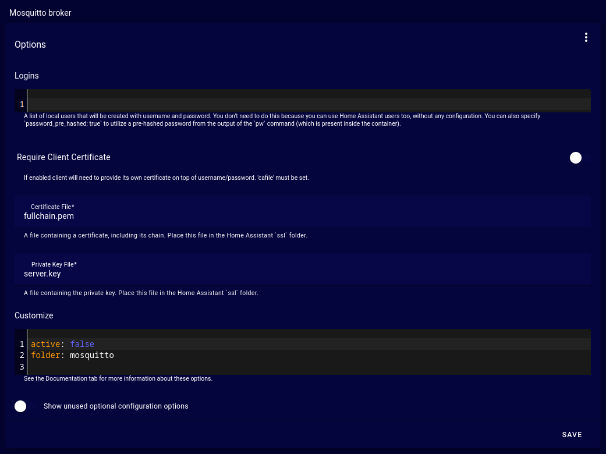
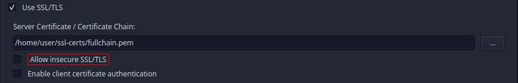
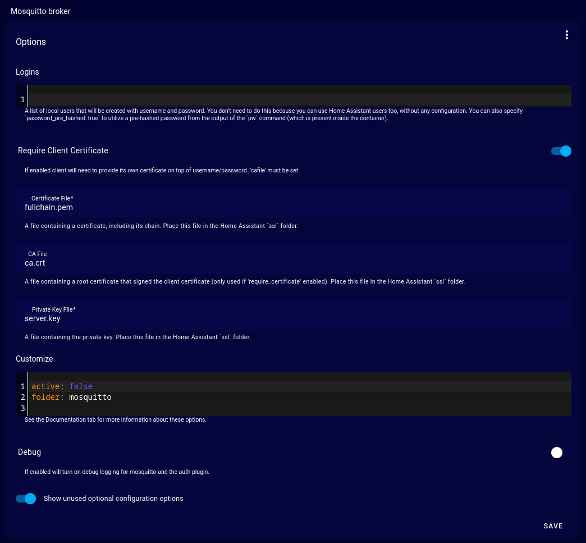
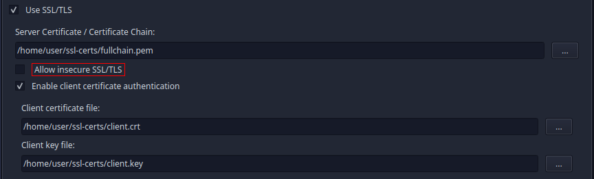

# 1. Getting certificates from a Certificate Authority (CA) for mosquitto

This is highly depending on the CA you are using to generate certificates needed.

Follow the specific instructions of your CA to get a `fullchain.pem`, `server.key` and `ca.crt` file. The files might have
different names, depending on your CA, but in general `fullchain.pem` contains your server certificate + your CAs 
certificate (+intermediate certificates) + a key file for your server certificate. Should you receive differently
named files, you can either rename them to match the ones in this documentation, or make sure to replace whatever is
written in this documentation with the actual filenames of the files you've received.

Once you've got the necessary files, proceed with [Setting up mosquitto](#3-setting-up-mosquitto).

# 2. Creating self-signed certificates for mosquitto

This guide shows you how to create a CA and a self-signed server certificate. Be warned, though, that this is not 
recommend and I do not encourage you to use self-signed certificates at all, due to Security concerns connected. 
It's probably not even that much better than using plaintext MQTT, as it could give you a false sense of security. 

Let me repeat: **using self-signed certificates is NOT recommended**. On the other hand exposing Home Assistant to 
the WWW is also not recommended, which means you are not really able to get a server certificate by a real CA, neither. 

To start with the creation of a CA and a self-signed certificate anyway, open a terminal and execute the following commands:

### Generate a 2048bit key for your own CA, protect it with AES 256bit and a passphrase
`openssl genrsa -aes256 -out ca.key 2048` \
⇒ set a passphrase for the CA key

### Generate a new x509 certificate for your own CA
`openssl req -new -x509 -days 3650 -key ca.key -out ca.crt` \
⇒ first provide the passphrase for the CA key \
⇒ next provide whatever information you feel like (press the `[Return]`-key to skip whatever you don't want to provide.)

### Generate a 2048bit key for your MQTT Server (broker), no passphrase for this one
`openssl genrsa -out server.key 2048`

### Generate Certificate Signing Request (CSR) for a new certificate for your MQTT Server
`openssl req -new -out server.csr -key server.key` \
⇒ provide whatever you feel like, until you reach `Common Name (e.g. server FQDN or YOUR name) []:`. 
Set this to your Home Assistant's hostname, e.g. homeassistant.local (this is important and MUST match!)

### Sign the CSR with the CAs key and generate the server certificate
`openssl x509 -req -in server.csr -CA ca.crt -CAkey ca.key -CAcreateserial -out server.crt -days 3650` \
⇒ provide the passphrase for the CA key

### Generate a fullchain PEM file, by combining CA and Server certificate 
`cat server.crt ca.crt > fullchain.pem`
(you can also just create a new file with the name `fullchain.pem`)

### (optional) Generate a Client Certificate for Easy MQTT Handler
You only need to follow those steps if you want Easy MQTT Handler to authenticate via SSL/TLS certificate. 
If you just want the traffic to be encrypted (basically like https), you don't need to create a client certificate.\
`openssl genrsa -out client.key 2048`

Next you need to create a CSR for the new client certificate: \
`openssl req -new -key client.key -out client.csr`
⇒ provide whatever you feel like

### Sign the CSR with the CAs key and generate the client certificate
`openssl x509 -req -in client.csr -CA ca.crt -CAkey ca.key -CAcreateserial -out client.crt -days 3650` \
⇒ provide the passphrase for the CA key

# 3. Setting up mosquitto

No matter, whether you've created a self-signed server certificate, like described above, or you are using a CA to get
a real server certificate you now need to upload it and the server key to your Home Assistant and configure mosquitto to
make use of them.

You need to upload `fullchain.pem`, `server.key` (and optionally `ca.crt`, if you want to use certificate-based
authentication for MQTT clients) to your Home Assistant host (you'll most likely use (win)SCP).
The files need to be uploaded into Home Assistant's `ssl` folder. Mine is `/usr/share/hassio/ssl`, for example,
but it might be different for you, depending on your Home Assistant setup.

Now you have two options:

### a) Use SSL/TLS for encryption in transit, only

Set all the options like you can see in this screenshot:

The important settings in this scenario are:
- **Certificate File**: `fullchain.pem`
- **Private Key File**: `server.key`

Last steps remaining are to click on `Save` and  then restarting mosquitto to apply the new configuration.

Now you can configure Easy MQTT Handler to use the `fullchain.pem` file you've got to connect to mosquitto. Just open the
tool and configure it like this in the Connection tab:

Remember to use port **8883**, if you are connecting to mosquitto on Home Assistant, as this is the default port for 
SSL/TLS connections.

### b) Enabling certificate-based authentication for MQTT clients:

The steps are almost identical to the setup above, but for certificate-based authentication for MQTT clients you should
configure the mosquitto options like this:

The important settings in this scenario are:

- **Require Client Certificate**: enabled
- **Show unused optional configuration options**: enabled
- **Certificate File**: `fullchain.pem`
- **CA File**: `ca.crt`
- **Private Key File**: `server.key`

Last steps remaining are to click on `Save` and  then restarting mosquitto to apply the new configuration.

No matter which scenario you have chosen, open the `Log` tab. It should contain a line like this directly after the
restart of mosquitto: `INFO: Certificates found: SSL is available`. If you can see this, you are ready to proceed
with the configuration of Easy MQTT Handler. Just open the tool and configure it like this in the Connection tab:

Again, remember to use port **8883**, if you are connecting to mosquitto on Home Assistant, as this is the default port for 
SSL/TLS connections.

